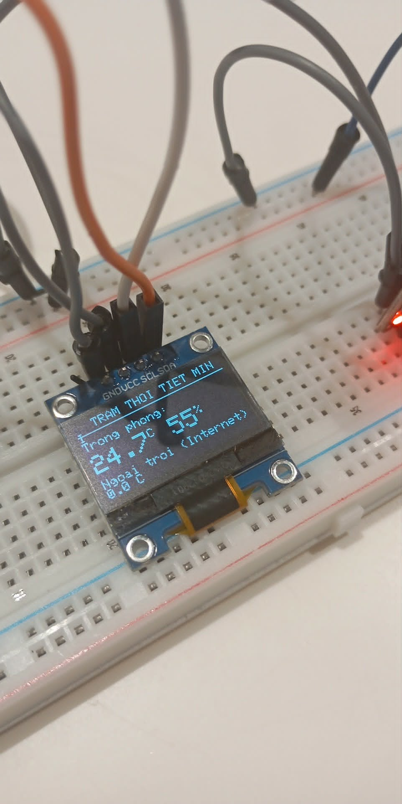
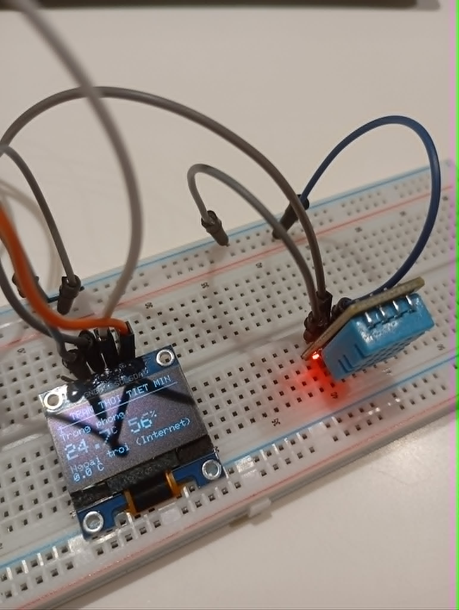

# IoT Mini Weather Station (ESP32)

A compact, real-time weather monitoring project using ESP32, DHT11 sensor, and an OLED display. This device tracks indoor climate conditions and fetches live outdoor temperature data from the internet.

## What is it?
This project is an IoT-based mini weather station designed to monitor environmental conditions. It combines local sensor data with web-based climate information, providing a comprehensive view of both the immediate room environment and the external weather.

## How it works (Algorithm)
The system operates on a continuous loop with the following logic:
1. **Local Sensing:** The ESP32 reads humidity and temperature data from the **DHT11** sensor.
2. **Connectivity:** The device connects to Wi-Fi (Home or Enterprise) to access the internet.
3. **Data Fetching:** It sends a HTTP GET request to the `open-meteo.com` API to retrieve real-time outdoor temperature data.
4. **Processing:** The JSON response from the API is parsed to extract the current weather information.
5. **Visualization:** Finally, all data (indoor temperature, humidity, and outdoor temperature) is rendered on the **SSD1306 OLED display** via the I2C protocol.

## Components Used
* **Microcontroller:** ESP32 Development Board.
* **Sensor:** DHT11 (Digital Humidity and Temperature Sensor).
* **Display:** SSD1306 0.96" OLED Display (I2C).
* **Connectivity:** Wi-Fi (built-in ESP32).
* **Miscellaneous:** Breadboard and Jumper Wires.

## Wiring Guide
| Component | ESP32 Pin |
| :--- | :--- |
| **DHT11 Data** | GPIO 4 |
| **OLED SDA** | GPIO 21 |
| **OLED SCL** | GPIO 22 |
| **VCC/GND** | 3.3V / GND |

*Ensure you connect the OLED VCC and DHT11 VCC to the 3.3V pin on the ESP32.*

## Applications
* **Home Automation:** Monitor room comfort levels for health and HVAC optimization.
* **Educational IoT:** An excellent project for beginners to learn about API integration, JSON parsing, and sensor interfacing.
* **Smart Environment:** Can be scaled to log historical climate data to a cloud database (like Firebase or Thingspeak).

---
*Created by [Quang Nguyen Ngoc/ngngocquang07]*
